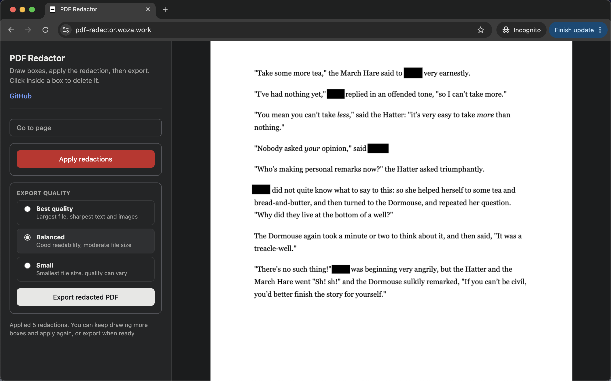

# Offline PDF Redactor
A minimalist local browser based tool to redact text in PDF documents.

- Offline-first and privacy-first web app.
- Runs completely offline. All processing is done locally, in the browser.
- No installation needed. Simply double-click the index.html file to launch from your desktop. The app will open in your browser. 
- Simple UI - drop the file, draw the boxes, click export. Delete a box by clicking inside it.
- Free and open source.

Live demo: 
https://pdf-redactor.woza.work/

 

Simple UI

 

Drawing a black box over text does not hide it. It just places a vector shape on top of the text layer. This leaves the underlying text completely extractable via a simple copy-paste.

This app  applies true destructive flattening (Rasterization). Instead of just overlaying a black rectangle annotation over a PDF text object, this app destroys the original document structure:

- Renders the PDF page directly into raw canvas pixels.

- Burns the black boxes straight into that pixel buffer.

- Exports the final page as a compressed flat image layer inside a new PDF.

Because the output is just a picture of the redacted page, there is no underlying text metadata to exploit.

 

## Self Verification

Instead of just trusting that the export worked, the app takes the exact PDF blob it just created, re-opens it, and runs PDF.js's text-extraction across every page of the file.

It counts every character of extractable text found. Because each page was exported as a rasterized JPEG image rather than real text/vector content, a properly redacted file should have zero extractable characters.

## How to use ofline
Download the project folder and place it on your desktop. Then double click the index.html file. The app will open in your browser.

## How to manually verify that redacted text has been burned out
- Open the exported PDF in your preferred pdf viewer.
- Click on the text, then select all content by pressing Cmd + A.
- Copy the selected content by pressing Cmd + C.
- Open a plain text editor.
- Paste the content by pressing Cmd + V.
- <b>Verify</b>: Check the pasted text content. The redacted text should not appear anywhere.
- <b>Important</b>: If any of your redacted words or phrases show up, the redaction was not properly applied, and the document is not safe to share.

 

## Notes
- The rasterized PDF pages that you see in the editor can look a little blurry, but the resolution of the exported file can be manually set.
- Before starting redaction it's a good idea to do a test export to ensure that you are happy with the quality and with the file size, because the exported file size will be much larger that your original pdf.
- Try to draw boxes with generous margin around the text to ensure that a a sliver of the original content does not remain visible.
- Do a visual double-check of the final exported file before sharing.

 

## Revision History

Version 1.0 
27-June-2026 
First release.

 

